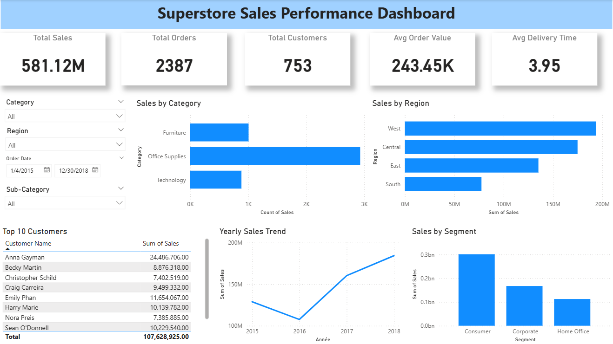

# 📊 Superstore Sales Performance Analysis

## 📌 Project Overview

This project analyzes e-commerce sales data to uncover key insights about revenue performance, customer behavior, and business growth opportunities.

---

## 🎯 Objective

Analyze sales data to identify trends and improve overall business performance.

---

## 🧹 Data Cleaning

* Checked missing values (11 missing in Postal Code)
* Applied mean imputation to handle missing values
* Verified dataset completeness
* Checked duplicates (no duplicates found)

---

## 📊 Key Insights

### 💰 Revenue

* Total revenue exceeds $2.2M, indicating strong business performance.

### 📦 Category Performance

* Technology is the top-performing category.
* Phones and Chairs are the highest revenue-generating sub-categories.

### 🌍 Regional Analysis

* West region leads in sales, followed by East.
* South region shows the lowest performance → growth opportunity.

### 👥 Customer Behavior

* A small group of customers generates a large portion of revenue.
* High-value customers are critical for business success.

### 📈 Sales Trend

* Overall growth trend over the years.
* Significant increase from 2017 to 2018.

### 🚚 Delivery Performance

* Average delivery time ≈ 4 days.
* Indicates efficient logistics but still improvable.

### 🧾 Segment Analysis

* Consumer segment dominates revenue.
* Corporate and Home Office have lower contribution.

---

## 💼 Business Recommendations

* Focus on high-performing categories (Technology)
* Strengthen top regions (West & East)
* Improve performance in South region
* Retain high-value customers (loyalty programs)
* Promote top sub-categories (Phones, Chairs)
* Leverage peak seasons (Nov & Dec)
* Optimize delivery process
* Expand Corporate & Home Office segments

---

## 📈 Dashboard

---

## 🛠️ Tools Used

* Python (Pandas, NumPy)
* Power BI

---

## 🚀 Project Structure

* Data cleaning & preprocessing
* Exploratory data analysis (EDA)
* Business insights
* Dashboard visualization

---

## 👤 Author

DOHA TIRAOUI
